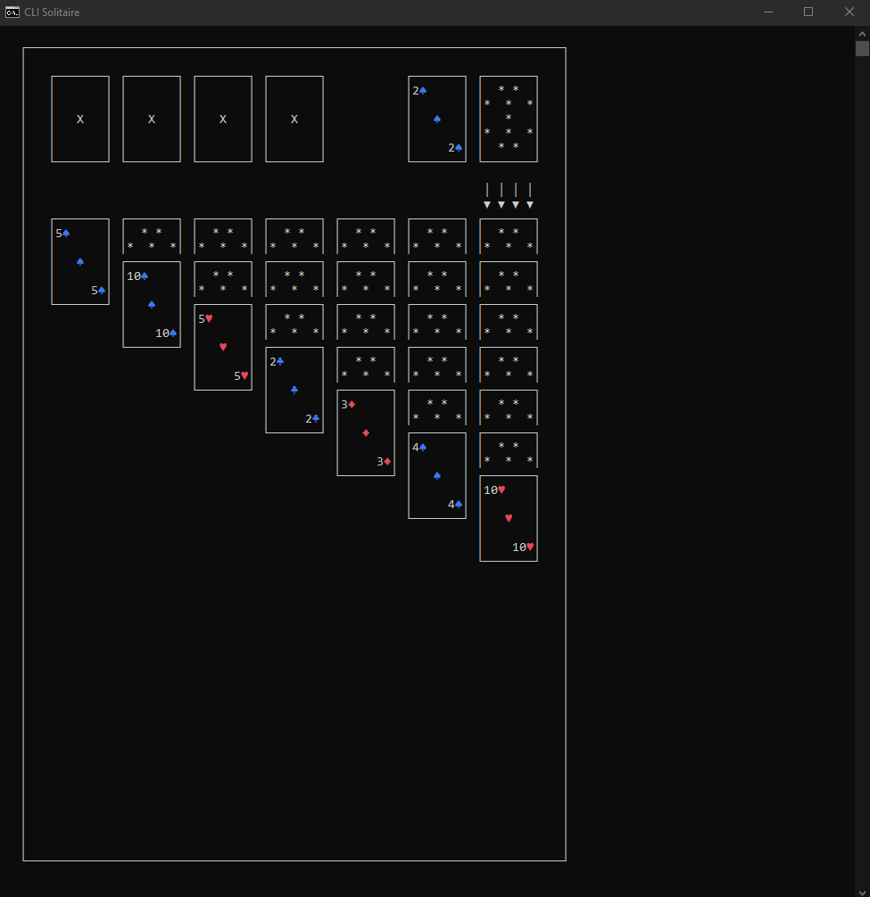

SolitaireApp
A fully functional Klondike Solitaire game that runs in the console, built in C# as a self-directed proof-of-knowledge project. No tutorials were followed for this implementation — the architecture, rendering approach, and game logic were all designed independently.

Show Image

About
This project was built to consolidate everything learned during a formal C# training curriculum and prove that knowledge could be applied independently to a non-trivial problem. The result is a playable Solitaire game navigated entirely via keyboard, rendered in a terminal using a custom coordinate-based drawing system.

Features

Full Klondike Solitaire rules implemented (Tableau, Foundation, Stock, and Waste piles)
Arrow key navigation with a moveable cursor across all piles
Custom console render engine using 2D character grids stamped at precise coordinates
Unicode suit symbols with color-coded rendering (red for ♥ ♦, blue for ♣ ♠)
Move validation for both Tableau and Foundation pile rules
Win detection
Clean separation between game logic (SolitaireLibrary) and console UI (SolitaireConsoleUI)

Architecture
The solution is split into two projects:
SolitaireLibrary — contains all game logic with no UI dependencies

PlayingCard.cs — card entity
Deck.cs — deck creation and shuffling
CardPile.cs — pile management (supports all pile types)
Board.cs — overall game state
Actions.cs — all game actions including move validation, dealing, and win detection
GameSettings.cs — centralized game constants

SolitaireConsoleUI — handles all rendering and input

RenderEngine.cs — coordinate-based console renderer using Console.SetCursorPosition
KeyboardInput.cs — arrow key navigation and Enter to select
Menu.cs — menu system
Game.cs — main game loop
Assets/ — card and board visual assets stored as character grids

How to Run
Requirements

.NET 6.0 SDK or later

Steps
bashgit clone https://github.com/apnihiser/SolitaireApp.git
cd SolitaireApp
dotnet run --project SolitaireConsoleUI
Controls
KeyAction← →Move cursor left / right within a row↑ ↓Move cursor between top and bottom rowsEnterSelect pile / confirm move

What I Learned

Modeling a domain cleanly with separated entities (card, pile, board, actions)
Building a coordinate-based rendering system in a terminal environment
Handling raw keyboard input including arrow key capture with Console.ReadKey(true)
Applying single responsibility principle across both library and UI layers
Thinking through game state management without relying on external frameworks

Built With

C# / .NET 6
Console UI only — no external dependencies
